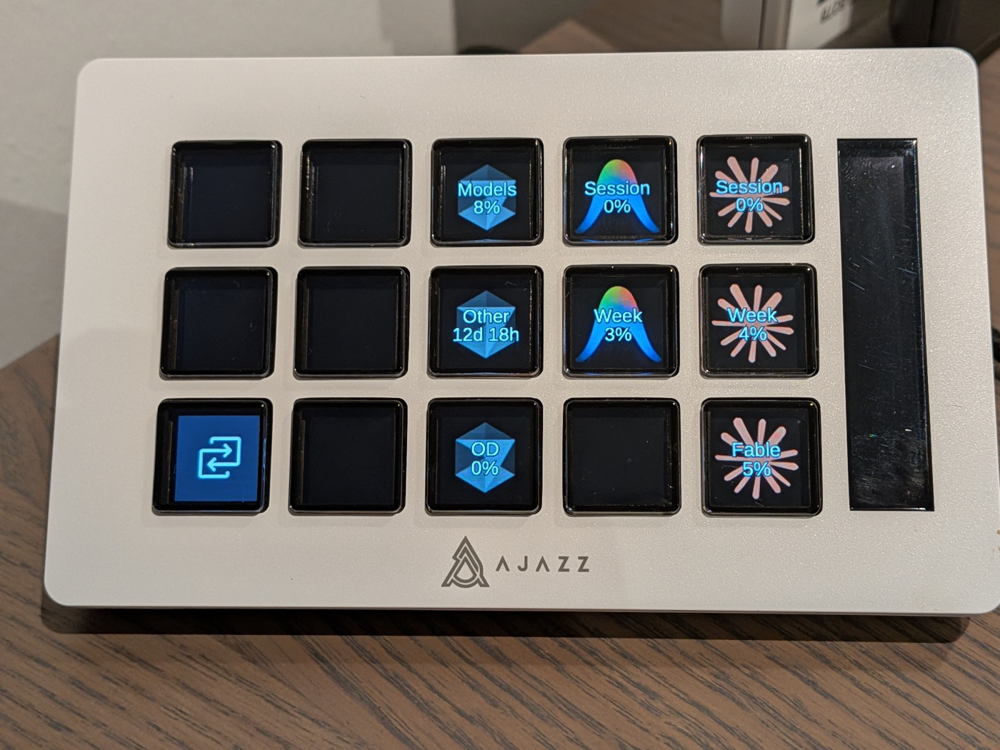

# Deckhand

**Live plan usage and one-press jump to the AI session that needs you — on a Stream Deck, local to your Mac.**



Deckhand is a local service that watches your Claude Code and Cursor sessions and turns Stream Deck buttons into real actions: glance your plan usage, jump to whichever session is waiting on you, cycle through pending input. It runs on `127.0.0.1`, talks to [OpenDeck](https://github.com/niclasmattsson/OpenDeck) today, and stays out of your way the rest of the time.

## Why Deckhand

- **See usage at a glance** — Session and weekly plan bars for Claude Code, Cursor, and Antigravity on a button face, updating live.
- **Jump to the session that needs you** — One press focuses the Claude or Cursor session waiting on input (or cycles through the queue).
- **Stays on your Mac** — No cloud orchestration, no remote execution, no telemetry. Core binds to `127.0.0.1`.

## Who it's for

Deckhand is for developers who run multiple AI coding sessions and want tactile control over them.

It is *not* a generic home-automation hub or cross-device button platform. If you want that, [Bitfocus Companion](https://bitfocus.io/companion) or [Touch Portal](https://www.touch-portal.com/) probably fit better.

## What you need

- **macOS** (AppleScript focus for iTerm; Cursor focus is supported)
- **[OpenDeck](https://github.com/niclasmattsson/OpenDeck)** — the only Stream Deck client today; official Elgato plugin is planned
- **Python 3.11+** and **[uv](https://docs.astral.sh/uv/)**

## Quick start (~15 minutes)

```bash
git clone https://github.com/LightbridgeLab/Deckhand && cd Deckhand
uv sync --all-extras
make config                              # copies config.example.toml → config.toml
# enable at least one usage plugin in config.toml — see config.example.toml
make dev                                 # foreground on http://127.0.0.1:18765
```

In another terminal:

```bash
make opendeck-plugin-install             # copies plugin into OpenDeck
# optional: make menubar                 # macOS menu-bar control for Core
```

Restart OpenDeck. Drag **Data Widget** onto a button, pick a state key (e.g. Claude session usage), set display format to `percentage`. The button shows `—` (and Core may log `GET /state/… 404`) until the first poll; that is expected. Within ~60 seconds the button updates.

Full walkthrough: **[Getting started](docs/GETTING_STARTED.md)** · Usage keys: **[Usage widgets](docs/USAGE.md)**

## Live sessions on a button

Usage widgets and session buttons are separate loops. For Agent Status, Agent Slot, or Agent Dashboard:

```bash
uv run deckhand hooks install            # Claude Code + Cursor
uv run deckhand hooks status
```

Start a session, then bind **Agent Status** and pick it from the dropdown. Details: **[Session hooks](docs/SESSION_HOOKS.md)**

## OpenDeck actions

| Action | What it does |
|--------|--------------|
| **Data Widget** | Live state on a button (usage bars, counts, text) |
| **Agent Status** | Monitor and interact with one session |
| **Agent Slot** | Fixed slot bound to a priority-ranked session |
| **Agent Dashboard** | Summary of all sessions; press to focus attention |
| **Run Action** | Execute any Deckhand action on press |
| **Signal Trigger** | Fire a Deckhand signal on press |

Property Inspector details: **[OpenDeck plugin](opendeck-plugin/README.md)** · Example layouts: **[Stream Deck profile ideas](docs/CURSOR_STREAM_DECK_PROFILES.md)**

## Documentation

| Doc | Audience |
|-----|----------|
| [Getting started](docs/GETTING_STARTED.md) | First install and first button |
| [Usage widgets](docs/USAGE.md) | Plan bars and state keys |
| [Session hooks](docs/SESSION_HOOKS.md) | Live Claude / Cursor sessions |
| [API reference](docs/API.md) | HTTP routes |
| [Event schema](docs/EVENTS.md) | WebSocket event types |
| [Plugin guide](docs/PLUGIN_GUIDE.md) | Extend Core with Python plugins |
| [Contributing](CONTRIBUTING.md) | Run tests, open issues, send PRs |

Shipped changes: [GitHub Releases](https://github.com/LightbridgeLab/Deckhand/releases). Planned work: [open issues](https://github.com/LightbridgeLab/Deckhand/issues).

## License

MIT — see [LICENSE](LICENSE).
